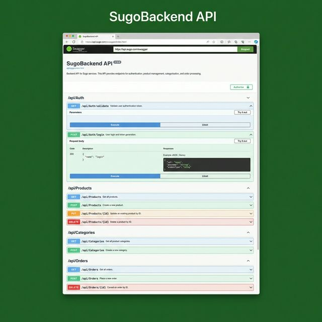
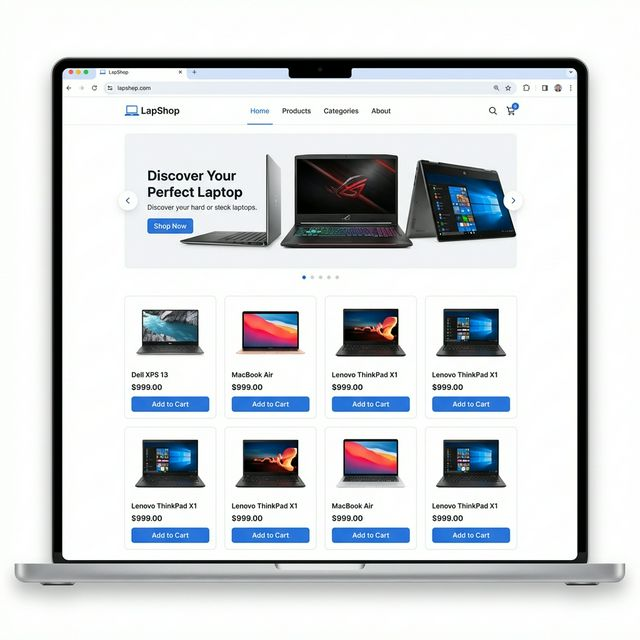

<div align="center">

# ⚡ Ismail Mohamed — Portfolio Website

### Backend Engineer · ASP.NET Core Developer · Web Developer

A modern, high-performance personal portfolio website showcasing real production projects,
API development skills, and backend architecture expertise.

[](https://asmaelprotfolio.netlify.app/)
[](https://github.com/AsmaelShowky70)


</div>

---

## 🖼️ Preview

<div align="center">

| Sugo Backend API | LapShop E-Commerce |
|:---:|:---:|
|  |  |

</div>

---

## 🚀 Features

- 🎨 **Modern Dark Theme** — Deep navy background with electric cyan accents and glassmorphism effects
- ✨ **Animated Hero Section** — Typing animation, gradient text, and circular profile photo with rotating ring
- 📂 **Featured Projects** — Showcasing real deployed projects with browser mockup screenshots
- 🔗 **GitHub Integration** — Dynamic repo fetching via GitHub REST API with static fallback
- 📄 **One-Page CV** — Professional CV page with "Save as PDF" functionality
- 📱 **Fully Responsive** — Mobile-first design with hamburger menu and adaptive layouts
- ⚡ **Performance Optimized** — Lazy loading, semantic HTML, and optimized assets
- 🔍 **SEO Ready** — Meta tags, Open Graph, sitemap.xml, and proper heading hierarchy

---

## 🛠️ Tech Stack

| Category | Technologies |
|----------|-------------|
| **Structure** | HTML5, Semantic Elements |
| **Styling** | CSS3, Custom Properties, Glassmorphism, CSS Grid, Flexbox |
| **Interactivity** | Vanilla JavaScript (ES6+) |
| **Animations** | CSS Keyframes, IntersectionObserver API |
| **API** | GitHub REST API |
| **Typography** | Google Fonts (Inter, Fira Code) |
| **Icons** | Inline SVGs |
| **Deployment** | Netlify (CI/CD, custom headers) |

---

## 📁 Project Structure

```
portfolio/
├── index.html              # Main portfolio page
├── cv.html                 # One-page CV with PDF export
├── css/
│   └── style.css           # Complete design system & theme
├── js/
│   └── main.js             # Animations, GitHub API, interactions
├── img/
│   ├── profile.jpg         # Profile photo
│   ├── sugo-screenshot.webp
│   ├── lapshop-screenshot.webp
│   └── health-screenshot.png
├── sitemap.xml             # SEO sitemap
├── robots.txt              # Search engine directives
├── netlify.toml            # Netlify deployment config
└── README.md
```

---

## 🌟 Sections

### 1. Hero Section
- Full-viewport with animated typing text cycling through roles
- Circular profile photo with rotating gradient ring
- Three CTA buttons: **View Projects**, **GitHub**, **Contact**
- Live stats: Live Projects · Profile Views · Technologies · Deployed

### 2. About Me
- Professional summary with backend focus
- 9-card skills grid (ASP.NET Core, EF Core, SQL Server, C#, REST APIs, …)
- Highlight cards: **Clean Architecture** · **Auth & Security** · **Production Deployed**

### 3. Featured Projects

#### 🔹 Sugo Backend API
> Production-ready ASP.NET Core Web API with JWT authentication, CRUD operations, DTOs, and Swagger documentation.

| | |
|---|---|
| 🌐 **Live** | [sugobackend.runasp.net/swagger](http://sugobackend.runasp.net/swagger/index.html) |
| 📦 **Repo** | [AsmaelShowky70/SugoBackend-Api-](https://github.com/AsmaelShowky70/SugoBackend-Api-) |

#### 🔹 LapShop — E-Commerce Platform
> Full-featured ASP.NET Core MVC e-commerce site with Bootstrap UI, repository pattern, and full product management.

| | |
|---|---|
| 🌐 **Live** | [lapshope.runasp.net](https://lapshope.runasp.net/) |
| 📦 **Repo** | [AsmaelShowky70/LapShop](https://github.com/AsmaelShowky70/LapShop) |

### 4. GitHub Repositories
- Dynamic cards fetched from the GitHub REST API
- Static fallback for offline / rate-limited scenarios

### 5. Contact
- Email, GitHub, LinkedIn, and WhatsApp links
- Download CV button

---

## ⚙️ Getting Started

```bash
# Clone this repository
git clone https://github.com/AsmaelShowky70/portfolio-.git
cd portfolio-

# Open in your browser (macOS / Linux / Windows)
open index.html          # macOS
xdg-open index.html      # Linux
start index.html         # Windows
```

> **No build tools or dependencies required** — it's a fully static site that runs directly in any modern browser.

---

## 📬 Contact

<div align="center">

| Channel | Link |
|:-------:|:-----|
| 📧 Email | [asmaelmohamed2025@gmail.com](mailto:asmaelmohamed2025@gmail.com) |
| 💻 GitHub | [@AsmaelShowky70](https://github.com/AsmaelShowky70) |
| 💬 WhatsApp | [+20 102 427 5208](https://wa.me/201024275208) |

</div>

---

## 📄 License

This project is open source and available under the [MIT License](LICENSE).

---

<div align="center">

**Built with ❤️ by Ismail Mohamed**

If you find this portfolio useful or inspiring, please ⭐ **star the repo** — it means a lot!

</div>
