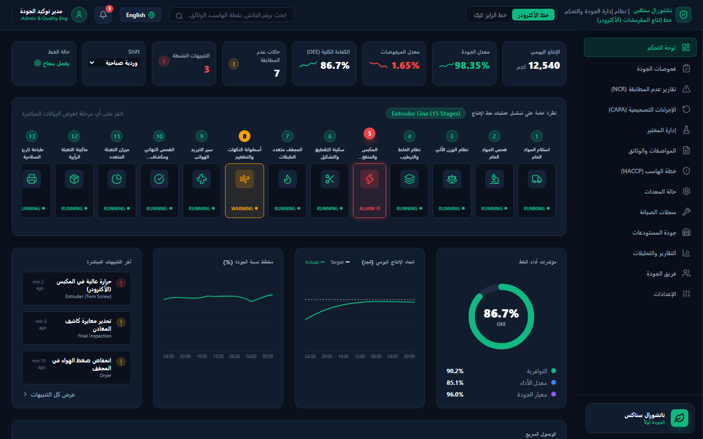
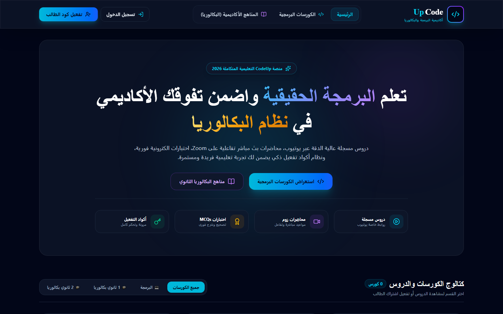
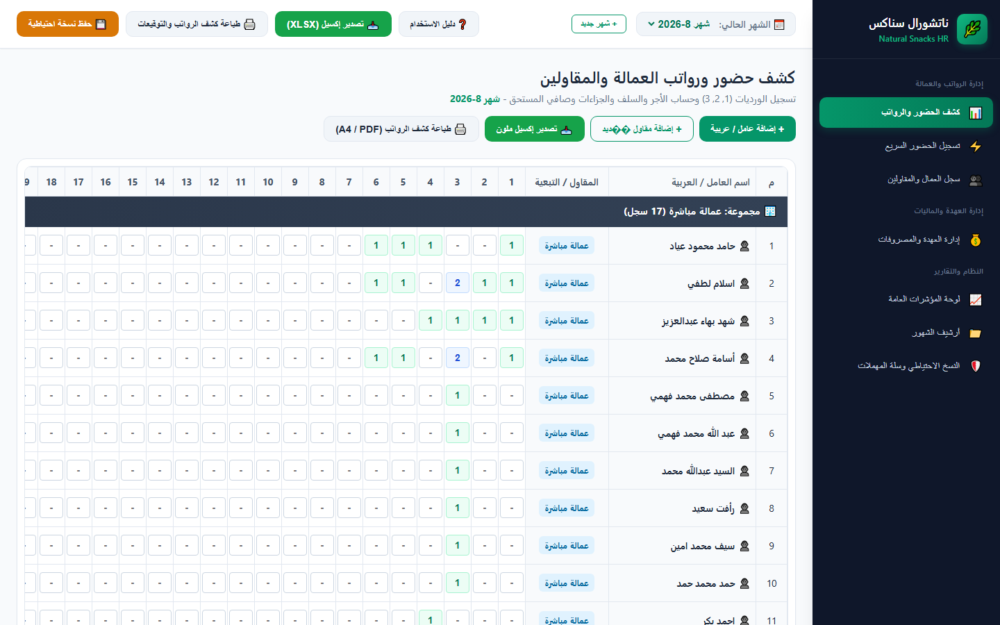
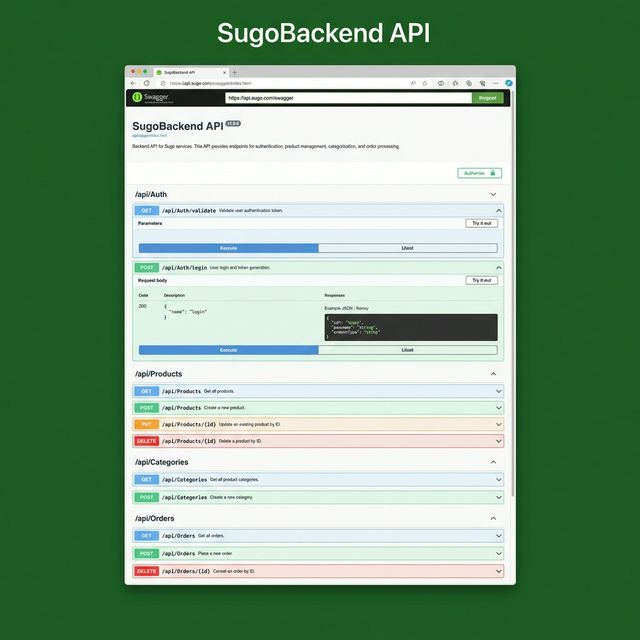
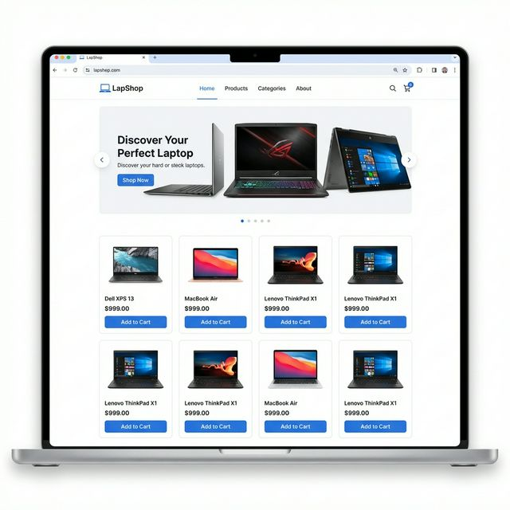

<div align="center">

# ⚡ Ismail Mohamed — Full-Stack & Mobile Developer Portfolio

### Full-Stack Developer · React.js · Node.js · ASP.NET Core · Flutter

A modern, high-performance personal portfolio website showcasing production web applications,
cross-platform mobile apps, industrial systems, and backend architecture expertise.

[](https://asmaelshowky70.github.io/portfolio/)
[](https://github.com/AsmaelShowky70)


</div>

---

## 🖼️ Preview

<div align="center">

| Natural Snacks QMS | CodeUp Tech Academy |
|:---:|:---:|
|  |  |

| LingoFlow AI (Flutter) | HR & Payroll Management |
|:---:|:---:|
|  |  |

| Sugo Backend API (Swagger) | LapShop E-Commerce |
|:---:|:---:|
|  |  |

</div>

---

## 🚀 Features

- 🎨 **Modern Dark Theme** — Deep navy background with electric cyan accents and glassmorphism effects
- ✨ **Animated Hero Section** — Typing animation, gradient text, and circular profile photo with rotating ring
- 📂 **Featured Projects** — Showcasing real deployed industrial, educational, and mobile platforms with live browser mockups
- 🔗 **GitHub Integration** — Dynamic repo fetching via GitHub REST API with static fallback
- 📄 **One-Page CV** — Professional print-ready CV page with "Save as PDF" functionality
- 📱 **Fully Responsive** — Mobile-first design with hamburger menu and adaptive layouts
- ⚡ **Performance Optimized** — Optimized assets, semantic HTML, and zero build tool overhead
- 🔍 **SEO Ready** — Open Graph tags, canonical URLs, sitemap.xml, and structured Person schema

---

## 🛠️ Tech Stack

| Category | Technologies |
|----------|-------------|
| **Frontend** | React.js (v19), HTML5, CSS3, Tailwind CSS, JavaScript (ES6+), Framer Motion |
| **Mobile** | Flutter, Dart (iOS & Android) |
| **Backend** | Node.js, Express, ASP.NET Core (Web API & MVC), C#, Entity Framework Core |
| **Databases** | Microsoft SQL Server, Relational Modeling, Migrations |
| **APIs & Security** | RESTful APIs, Swagger / OpenAPI, JWT Authentication, RBAC |
| **Hosting & CI/CD** | GitHub Pages, Live Cloud Deployments |

---

## 📁 Project Structure

```
portfolio/
├── index.html              # Main full-stack portfolio page
├── cv.html                 # Print-ready CV with PDF export
├── css/
│   └── style.css           # Complete design system, glassmorphism & theme
├── js/
│   └── main.js             # Typing animation, GitHub API & interactions
├── img/
│   ├── profile.jpg         # Profile photo
│   ├── qc-screenshot.png   # Natural Snacks QMS
│   ├── hr-screenshot.png   # HR & Payroll Management
│   ├── codeup-screenshot.png # CodeUp Academy Platform
│   ├── english-app-screenshot.png # LingoFlow AI App
│   └── studyai-screenshot.png # StudyAI Companion
├── sitemap.xml             # SEO sitemap
├── robots.txt              # Search engine directives
└── README.md
```

---

## 🌟 Featured Projects

### 1. 🔹 Natural Snacks — Quality Control System (QMS)
> Real-time industrial Quality Management System monitoring 15 extruder production stages, live OEE efficiency calculation, anomaly alarm logs, and non-conformance (NCR) incident reporting.
- 🌐 **Live Demo:** [asmaelshowky70.github.io/Quality-Control-Natural-snacks](https://asmaelshowky70.github.io/Quality-Control-Natural-snacks/)
- 📦 **Repository:** [AsmaelShowky70/Quality-Control-Natural-snacks](https://github.com/AsmaelShowky70/Quality-Control-Natural-snacks.git)

### 2. 🔹 Natural Snacks — HR & Payroll Management
> Offline-first Arabic HR and financial management system for factory labor and contractors. Automates attendance across shifts, wage computations, petty cash custody tracking, and direct Excel/PDF reporting.
- 🌐 **Live Demo:** [asmaelshowky70.github.io/HR-NaturalSnaks](https://asmaelshowky70.github.io/HR-NaturalSnaks/)
- 📦 **Repository:** [AsmaelShowky70/HR-NaturalSnaks](https://github.com/AsmaelShowky70/HR-NaturalSnaks.git)

### 3. 🔹 CodeUp — Tech Academy & Learning Platform
> Interactive full-stack coding platform featuring structured programming tracks, instant MCQ quizzes with confetti celebration feedback, video lecture catalog, and student activation codes.
- 🌐 **Live Demo:** [asmaelshowky70.github.io/CodeUp](https://asmaelshowky70.github.io/CodeUp/)
- 📦 **Repository:** [AsmaelShowky70/CodeUp](https://github.com/AsmaelShowky70/CodeUp.git)

### 4. 🔹 LingoFlow AI — English Practice Mobile App
> Cross-platform Flutter mobile application for interactive spoken English practice via AI role-playing personas. Supports voice and text pipelines, gamified points economy, and an ASP.NET Core API backend.
- 📦 **Repository:** [AsmaelShowky70/English-app](https://github.com/AsmaelShowky70/English-app.git)

### 5. 🔹 StudyAI — Intelligent AI Study Companion
> Next-generation SaaS educational web platform combining Computer Vision, NLP, and adaptive learning algorithms to convert study material into automated quizzes, flashcards, and academic progress analytics.
- 🌐 **Live Demo:** [asmaelshowky70.github.io/Study-Ai](https://asmaelshowky70.github.io/Study-Ai/)
- 📦 **Repository:** [AsmaelShowky70/Study-Ai](https://github.com/AsmaelShowky70/Study-Ai)

### 6. 🔹 Sugo — E-Commerce Backend API
> Enterprise-grade RESTful API backend engineered with ASP.NET Core and clean architecture. Features complete CQRS design, secure JWT authentication, role-based authorization, SQL Server EF Core migrations, and Swagger documentation.
- 📦 **Repository:** [AsmaelShowky70/SugoBackend-Api-](https://github.com/AsmaelShowky70/SugoBackend-Api-.git)

### 7. 🔹 LapShop — E-Commerce Web Application
> Full-featured electronics e-commerce store built with ASP.NET Core MVC. Features dynamic product catalogs, category filtering, cart management, and administrative dashboard.
- 📦 **Repository:** [AsmaelShowky70/LapShop](https://github.com/AsmaelShowky70/LapShop.git)

### 8. 🔹 Health Care Clinic Platform
> Modern, responsive medical clinic landing page with interactive doctor profiles, department showcases, and online appointment booking interface.
- 🌐 **Live Demo:** [asmaelshowky70.github.io/health](https://asmaelshowky70.github.io/health/)
- 📦 **Repository:** [AsmaelShowky70/health](https://github.com/AsmaelShowky70/health.git)

### 9. 🔹 Sugo UI — Cross-Platform Flutter Mobile App
> Clean, responsive mobile application built with Flutter serving as the client for the Sugo Backend API. Features reactive state management and smooth UX.
- 📦 **Repository:** [AsmaelShowky70/SugoUI](https://github.com/AsmaelShowky70/SugoUI.git)

### 10. 🔹 My E-Commerce Platform
> Complete ASP.NET Core MVC e-commerce platform with clean architecture, shopping cart, checkout workflow, and live deployment.
- 🌐 **Live Demo:** [myecommerce.tryasp.net](https://myecommerce.tryasp.net/)
- 📦 **Repository:** [AsmaelShowky70/ECommerce](https://github.com/AsmaelShowky70/ECommerce)

---

## ⚙️ Getting Started

```bash
# Clone this repository
git clone https://github.com/AsmaelShowky70/portfolio-.git
cd portfolio-

# Open in your browser (Windows / macOS / Linux)
start index.html         # Windows
open index.html          # macOS
xdg-open index.html      # Linux
```

> **No build tools or external dependencies required** — pure, fast static web architecture.

---

## 📬 Contact

<div align="center">

| Channel | Link |
|:-------:|:-----|
| 📧 Email | [asmaelmohamed2025@gmail.com](mailto:asmaelmohamed2025@gmail.com) |
| 💬 WhatsApp | [+20 120 879 4479](https://wa.me/201208794479) |
| 💻 GitHub | [@AsmaelShowky70](https://github.com/AsmaelShowky70) |

</div>

---

## 📄 License

This project is open source and available under the [MIT License](LICENSE).

<div align="center">

**Built with ❤️ by Ismail Mohamed**

If you find this portfolio useful, please ⭐ **star the repo**!

</div>
